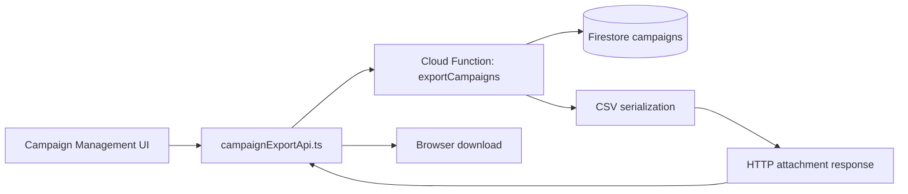
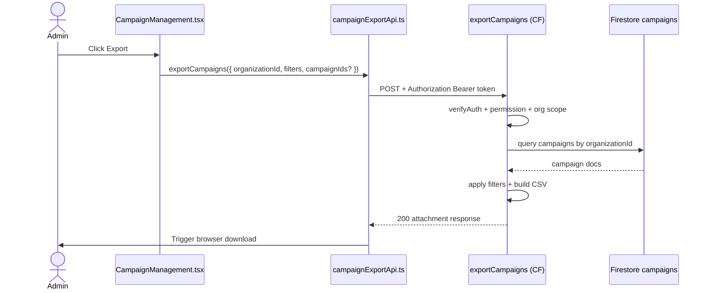

# Campaign Export Flow

## 1) Purpose

This document explains the campaign CSV export flow end-to-end:

- export trigger from Admin Campaign Management
- backend auth/permission and organization checks
- filter application and CSV generation
- browser download behavior

---

## 2) Scope

### In Scope

- Admin-triggered campaign export
- optional filtering by search, status, category, and date range
- optional targeted export using `campaignIds`
- backend CSV response as downloadable attachment

### Out of Scope

- campaign creation/editing lifecycle
- donation and gift aid exports
- scheduled export jobs

---

## 3) Files and Ownership

### Frontend

- `src/views/admin/CampaignManagement.tsx`
  - `handleExportCampaigns` request trigger and UI loading/toast handling

- `src/entities/campaign/api/campaignExportApi.ts`
  - authenticated function call
  - attachment filename parse + blob download

- `src/shared/config/functions.ts`
  - `FUNCTION_URLS.exportCampaigns`

### Backend

- `backend/functions/handlers/campaignsExport.js`
  - auth, permission, org-scope enforcement
  - filter logic and CSV generation

- `backend/functions/index.js`
  - function registration: `exports.exportCampaigns`

---

## 4) High-Level Architecture

---

## 5) How / Why / Where

## A) UI Trigger

How:

1. Admin clicks Export.
2. UI checks `export_campaigns` permission and `organizationId`.
3. UI sends current filter state in request.

Why:

- export should mirror current admin filtering intent.

Where:

- `src/views/admin/CampaignManagement.tsx`

## B) API Bridge

How:

1. Get Firebase ID token.
2. `POST` request to `FUNCTION_URLS.exportCampaigns`.
3. On success, parse `content-disposition` filename and trigger blob download.

Why:

- keeps auth and download handling centralized and reusable.

Where:

- `src/entities/campaign/api/campaignExportApi.ts`

## C) Backend Export Logic

How:

1. Verify auth token.
2. Load caller profile from `users/{uid}`.
3. Enforce:
   - `export_campaigns` or `system_admin`
   - non-system admins can export only own organization
4. Query campaigns by `organizationId`.
5. Apply optional `campaignIds` and filters.
6. Build CSV and return attachment.

Why:

- backend authority guarantees security and complete dataset export.

Where:

- `backend/functions/handlers/campaignsExport.js`

---

## 6) Sequence

---

## 7) Request Contract

- `organizationId: string` (required)
- `campaignIds?: string[]`
- `filters?:`
  - `searchTerm?: string`
  - `status?: string`
  - `category?: string`
  - `dateRange?: "all" | "last30" | "last90" | "last365"`

---

## 8) Security and Validation

- method must be `POST`
- caller profile must exist
- permission must include `export_campaigns` or `system_admin`
- organization scope enforced for non-system admins
- CSV formula sanitization is applied for string fields

---

## 9) Response Contract

Success:

- status `200`
- `Content-Type: text/csv; charset=utf-8`
- `Content-Disposition: attachment; filename="campaigns-{orgId}-{timestamp}.csv"`

Failures:

- `400` invalid payload
- `403` permission/org-scope violation
- `405` method not allowed
- `500` unexpected backend error

---

## 10) Testing Checklist

1. Export succeeds with valid permission and organization.
2. Cross-organization export blocked for non-system-admin.
3. `campaignIds` restrict exported rows correctly.
4. Filters produce expected subset.
5. Download filename and CSV content are correct.
