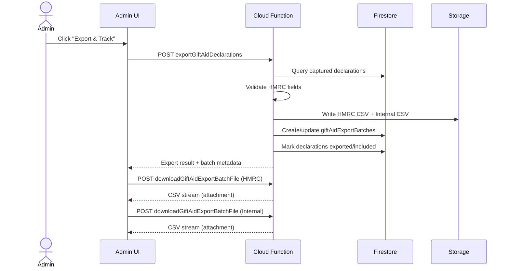
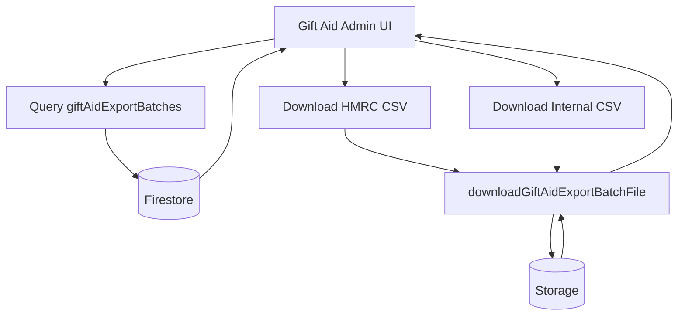

# Gift Aid Export Flow (Server-Side)

This document describes the end-to-end Gift Aid export flow implemented in this repo: triggers, sequence, state transitions, and data artifacts.

## 0. System Overview

### 0.1 Actors

- Admin / Super Admin: initiate exports and download history
- Manager: download history only

### 0.2 Stores

- Firestore:
  - `giftAidDeclarations`
  - `giftAidExportBatches`
- Storage:
  - `giftAidExports/{organizationId}/{batchId}/`

### 0.3 Flow Diagrams

#### 0.3.1 Export & Track (Sequence)

#### 0.3.2 Export History (Flow)

## 1. Primary Triggers

### 1.1 Admin UI: "Export & Track"

- Location: `src/views/admin/GiftAidManagement.tsx`
- Trigger: Admin clicks **Export & Track**
- Preconditions:
  - User must have permission `export_giftaid`
  - User must be in an organization context

### 1.2 Admin UI: Export History Re-Download

- Location: `src/views/admin/GiftAidManagement.tsx`
- Trigger: Admin/Manager clicks **HMRC CSV** or **Internal CSV** in Export History
- Preconditions:
  - User must have permission `download_giftaid_exports`

## 2. Backend Export Flow (Export & Track)

### 2.1 HTTP entrypoint

- Function: `exportGiftAidDeclarations`
- Location: `backend/functions/handlers/giftAid.js`
- Auth: Firebase ID token (Bearer)
- Permission enforced via `export_giftaid` on caller's `users/{uid}` doc

### 2.2 Scope resolution (server-side)

- Query:
  - Collection: `giftAidDeclarations`
  - Filters:
    - `organizationId == <requested org>`
    - `operationalStatus == captured`

### 2.3 Validation

- File: `backend/functions/services/giftAidExport.js`
- Checks required for HMRC schedule:
  - donorFirstName
  - donorSurname
  - donorHouseNumber
  - donorPostcode
  - donationDate (valid)
  - donationAmount > 0

### 2.4 Export file generation

- File: `backend/functions/services/giftAidExport.js`
- Outputs:
  - **HMRC CSV**
    - fields in HMRC schedule order
    - amount is donation amount (pounds, 2 decimals)
  - **Internal CSV**
    - richer operational fields
    - amounts remain pence

### 2.5 Batch creation + storage

- Batch doc: `giftAidExportBatches`
- Storage path:
  - `giftAidExports/{organizationId}/{batchId}/`
- Stored files:
  - `gift-aid-hmrc-schedule-<timestamp>.csv`
  - `gift-aid-internal-pence-<timestamp>.csv`

### 2.6 Declaration updates (tracking)

Each exported declaration is updated:

- `operationalStatus = exported`
- `hmrcClaimStatus = included`
- `exportBatchId = <batchId>`
- `exportActorId = <uid>`
- `exportedAt = <timestamp>`

### 2.7 Response to UI

The function returns:

- `batchId`
- `rowCount`
- `hmrcFile` metadata (fileName, storagePath, size, sha256)
- `internalFile` metadata

## 3. Download Flow

### 3.1 Download from Export & Track

- UI uses `downloadGiftAidExportFile(...)`
- API file: `src/entities/giftAid/api/giftAidExportApi.ts`
- It calls backend endpoint:
  - `downloadGiftAidExportBatchFile`
  - Location: `backend/functions/handlers/giftAid.js`

### 3.2 Download from Export History

- UI buttons for HMRC/Internal
- Same backend endpoint:
  - `downloadGiftAidExportBatchFile`
- Permission enforced via `download_giftaid_exports`

### 3.3 Backend download endpoint

- Function: `downloadGiftAidExportBatchFile`
- Validates:
  - batchId exists
  - fileKind is `hmrc` or `internal`
  - caller has `download_giftaid_exports`
  - caller is same organization unless `system_admin`
- Reads file from Storage and streams back with:
  - `Content-Type: text/csv; charset=utf-8`
  - `Content-Disposition: attachment; filename="<fileName>"`

## 4. Export History Data Flow

### 4.1 Fetching history

- UI calls `fetchGiftAidExportBatches(...)`
- File: `src/entities/giftAid/api/giftAidExportApi.ts`
- Query:
  - Collection: `giftAidExportBatches`
  - Filter: `organizationId == <current org>`

### 4.2 History presentation

- UI shows:
  - Batch id
  - Timestamp
  - Row count
  - Exported by
  - Status
  - Download buttons
- Pagination:
  - Page size: 8

## 5. Permissions

### 5.1 Permissions in use

- `export_giftaid`
  - required for **Export & Track**
- `download_giftaid_exports`
  - required for history re-downloads

### 5.2 Default role mapping

- super_admin: `export_giftaid`, `download_giftaid_exports`
- admin: `export_giftaid`, `download_giftaid_exports`
- manager: `download_giftaid_exports` only
- operator: none by default
- viewer: none

### 5.3 Permission sync for existing users

- Script: `backend/functions/scripts/grantGiftAidExportPermission.js`
- Command:
  - `npm run backfill:giftaid-export-permission`

## 6. Donor Title Capture (HMRC Title field)

### 6.1 Capture points

- Web Gift Aid form: `src/views/campaigns/GiftAidDetailsScreen.tsx`
- Kiosk Gift Aid form: `src/features/kiosk-gift-aid/components/GiftAidDetailsPanel.tsx`

### 6.2 Metadata propagation

- Gift Aid title sent in payment metadata:
  - `giftAidTitle`
- File: `src/views/campaigns/PaymentScreen.tsx`

### 6.3 Backend persistence

- One-off payments: `backend/functions/handlers/webhooks.js`
- Subscriptions: `backend/functions/handlers/subscriptions.js`

### 6.4 Export behavior

- HMRC CSV uses `donorTitle` when present
- If missing, HMRC title field is blank

## 7. Failure States and Notes

### 7.1 Empty export

- If no captured declarations, API returns:
  - `success: true`
  - `empty: true`
  - `message`

### 7.2 Validation errors

- If required HMRC fields missing:
  - export fails
  - returns `validationErrors`
  - no batch is marked completed

### 7.3 Download failures

- If file missing from Storage:
  - backend returns 404
  - UI shows "file unavailable" or download error

## 8. Emulator / Local Notes

### 8.1 Emulator toggle

- `NEXT_PUBLIC_USE_FIREBASE_EMULATORS=true` enables emulator mode
- `src/shared/config/firebaseEmulators.ts` reads emulator ports/host

### 8.2 Function URL overrides (optional)

- `NEXT_PUBLIC_EXPORT_GIFTAID_FUNCTION_URL`
- `NEXT_PUBLIC_DOWNLOAD_GIFTAID_BATCH_FILE_FUNCTION_URL`

If unset, the app uses deployed Cloud Functions URLs.
