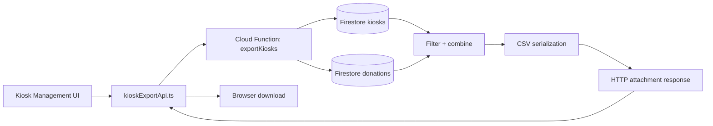
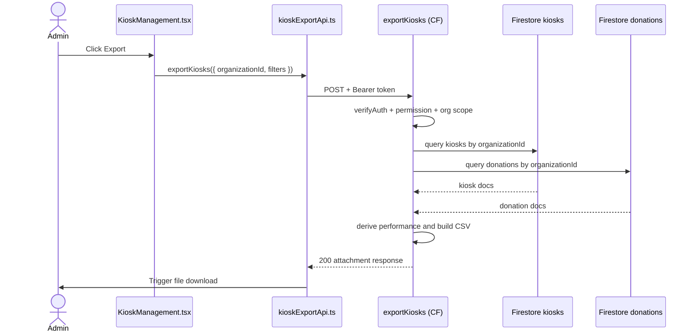

# Kiosk Export Flow

## 1) Purpose

This document explains the kiosk CSV export flow end-to-end:

- export trigger from Admin Kiosk Management
- backend permission and organization checks
- kiosk + donation aggregation for performance columns
- downloadable CSV response

---

## 2) Scope

### In Scope

- Admin-triggered kiosk export
- filter support for search and kiosk status
- computed performance fields (`totalRaised`, `totalDonations`)

### Out of Scope

- kiosk CRUD and assignment management
- campaign and subscription export logic
- scheduled exports

---

## 3) Files and Ownership

### Frontend

- `src/views/admin/KioskManagement.tsx`
  - `handleExportKiosks`

- `src/entities/kiosk/api/kioskExportApi.ts`
  - authenticated function call + browser download

- `src/shared/config/functions.ts`
  - `FUNCTION_URLS.exportKiosks`

### Backend

- `backend/functions/handlers/kiosksExport.js`
  - authorization + org guardrails
  - filtering + aggregation + CSV generation

- `backend/functions/index.js`
  - function registration: `exports.exportKiosks`

---

## 4) High-Level Architecture

---

## 5) How / Why / Where

## A) UI Trigger

How:

1. Admin clicks Export.
2. UI checks `export_kiosks` permission and `organizationId`.
3. UI sends `organizationId` and current filters.

Why:

- ensure export is scoped to active organization and visible filter intent.

Where:

- `src/views/admin/KioskManagement.tsx`

## B) API Bridge

How:

1. Retrieve current Firebase ID token.
2. `POST` to `FUNCTION_URLS.exportKiosks`.
3. Parse returned filename and download blob.

Why:

- centralizes auth, error handling, and download behavior.

Where:

- `src/entities/kiosk/api/kioskExportApi.ts`

## C) Backend Export Logic

How:

1. Verify auth and permissions (`export_kiosks` or `system_admin`).
2. Enforce same-org export for non-system-admin callers.
3. Query kiosks by organization (and optional status).
4. Query donations for same organization.
5. Build per-kiosk performance map:
   - `totalRaised`: sum of donation amounts by kiosk
   - `totalDonations`: unique donor count by kiosk
6. Emit fixed CSV schema and response attachment.

Why:

- combines operational kiosk state with donation outcomes in one export.

Where:

- `backend/functions/handlers/kiosksExport.js`

---

## 6) Sequence

---

## 7) Request Contract

- `organizationId: string` (required)
- `filters?:`
  - `searchTerm?: string`
  - `status?: "all" | "online" | "offline" | "maintenance"`

---

## 8) CSV Contract

Header order is fixed:

1. `name`
2. `location`
3. `status`
4. `kioskId`
5. `totalRaised`
6. `totalDonations`
7. `assignedCampaigns`
8. `lastActive`

Filename:

- `kiosks-{organizationId}-{YYYYMMDD-HHMMSSZ}.csv`

---

## 9) Security and Validation

- `POST` only
- caller must have kiosk export permission
- non-system-admin cross-org request is rejected
- CSV formula sanitization is applied

---

## 10) Testing Checklist

1. Export works for valid org and permission.
2. Search and status filters affect row set correctly.
3. `totalRaised` and `totalDonations` aggregation correctness.
4. Cross-org export blocked for non-system-admin.
5. CSV headers and filename format are stable.
