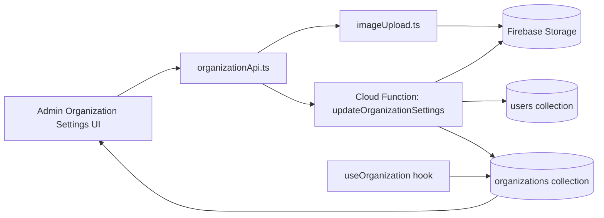
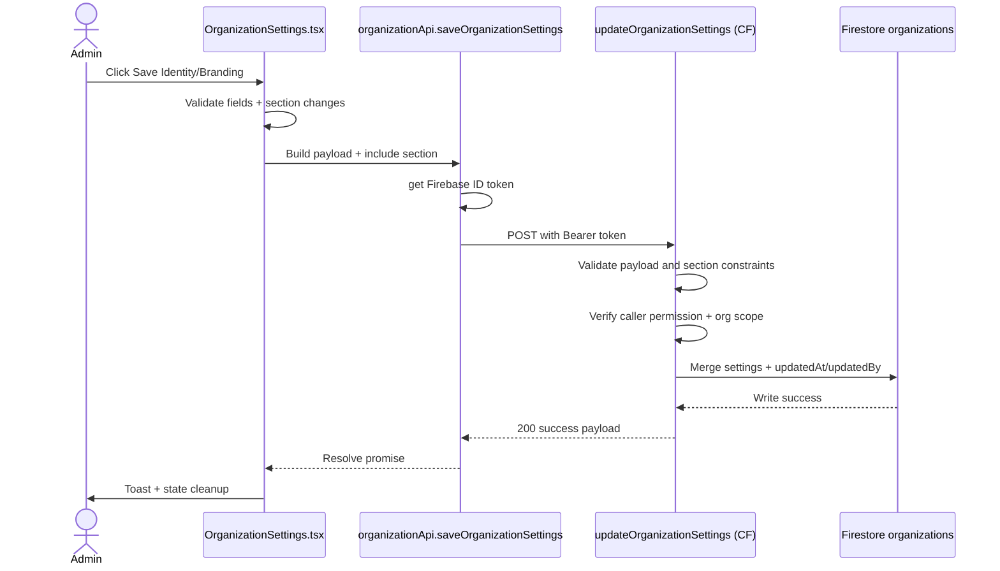
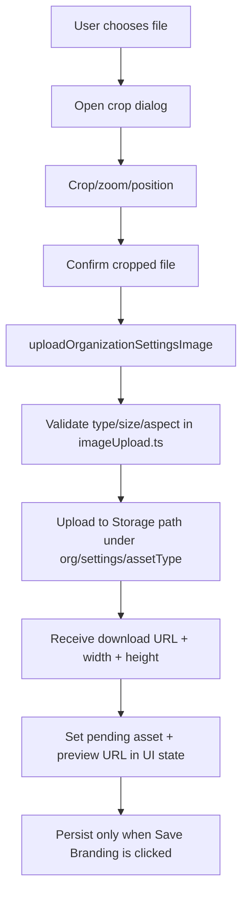
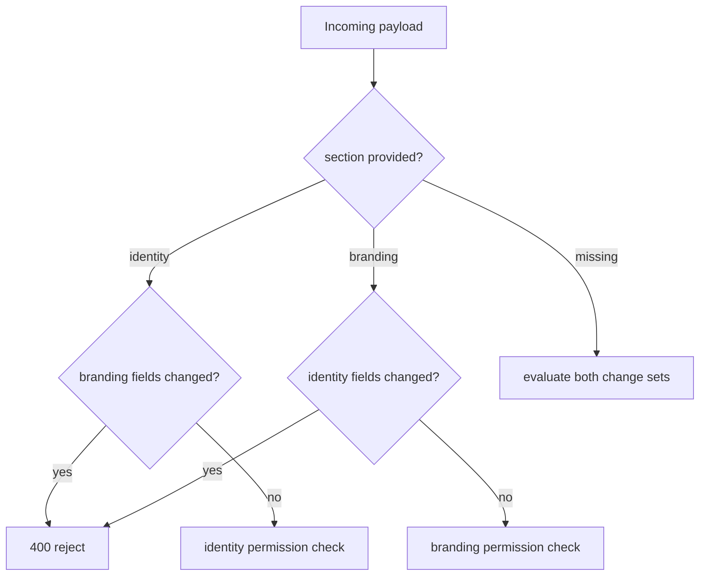

# Organization Settings Implementation Flow

## 1) Purpose

This document explains the Organization Settings page implementation end-to-end for:

- identity updates (display name, thank-you message)
- branding updates (accent color, logo, idle image)
- organization switching for super admins
- upload/remove/change behavior and validation gates
- production-scale design guidance

---

## 2) Scope

### In Scope

- Admin UI behavior in `OrganizationSettings.tsx`
- Client API bridge for uploads and secure settings persistence
- Cloud Function validation + authorization
- Firestore and Storage interactions
- Security and scaling considerations

### Out of Scope

- Stripe onboarding and bank details
- campaign/kiosk rendering internals consuming branding
- organization creation/deletion workflows

---

## 3) Files and Ownership

### Frontend UI

- `src/views/admin/OrganizationSettings.tsx`
  - form state, permission gating, crop dialog orchestration
  - section-based saves (`identity`, `branding`)
  - upload/remove actions and previews

- `src/views/admin/OrganizationSwitcher.tsx`
  - super-admin organization selector with search

- `src/shared/ui/SquareImageCropDialog.tsx`
  - client-side crop, zoom, drag, output file generation

### Frontend Data/API

- `src/shared/lib/hooks/useOrganization.ts`
  - real-time org data via Firestore `onSnapshot`
  - local cache hydration for better perceived performance

- `src/entities/organization/api/organizationApi.ts`
  - storage upload path generation
  - image upload entrypoint
  - secure function call for settings update

- `src/shared/lib/imageUpload.ts`
  - file type/size/aspect validation
  - Firebase Storage upload + download URL retrieval

- `src/shared/config/functions.ts`
  - function URL mapping (`updateOrganizationSettings`)

### Backend

- `backend/functions/handlers/organizationSettings.js`
  - payload validation and normalization
  - auth + permission + org-boundary enforcement
  - storage URL ownership verification
  - section guardrails (`identity` vs `branding`)
  - Firestore merge update with audit fields

- `backend/functions/index.js`
  - Cloud Function export registration (`updateOrganizationSettings`)

- `backend/storage.rules`
  - storage read/write permissions for org settings assets

---

## 4) High-Level Architecture

---

## 4.1) How / Why / Where (Implementation Narrative)

This section is the direct implementation flow in `how -> why -> where` format.

## A) Page Load and Initial Data Hydration

How:

1. Admin opens Organization Settings screen.
2. Page resolves `organizationId` from `userSession`.
3. `useOrganization(organizationId)` subscribes to Firestore org doc.
4. Form state is initialized from `organization.settings` (or fallback values).
5. Permission flags are derived (`canEditIdentity`, `canEditBranding`, `canSwitchOrganization`).

Why:

- Real-time subscription keeps admin UI consistent with latest saved org settings.
- Local form state allows edit buffering before save.
- Early permission derivation keeps UI and action buttons safe by default.

Where:

- `src/views/admin/OrganizationSettings.tsx`
- `src/shared/lib/hooks/useOrganization.ts`

## B) Upload Logo / Idle Image (Pre-Save Stage)

How:

1. User picks file from hidden input.
2. Crop dialog opens (`SquareImageCropDialog`) with aspect ratio:
   - logo: `1:1`
   - idle image: `9:16` (portrait)
3. On confirm, cropped file is validated and uploaded to Storage.
4. Upload response returns URL + dimensions + metadata.
5. UI stores asset as pending (`pendingLogo` / `pendingIdleImage`) and previews it.
6. No Firestore settings write happens yet.

Why:

- Crop-before-upload gives deterministic kiosk-ready media.
- Two-phase commit behavior (upload first, save settings later) avoids partial settings writes.
- Pending state allows users to review changes before persisting.

Where:

- `src/views/admin/OrganizationSettings.tsx` (`handleLogoFileChange`, `handleIdleImageFileChange`, `handleUploadImage`)
- `src/shared/ui/SquareImageCropDialog.tsx`
- `src/entities/organization/api/organizationApi.ts` (`uploadOrganizationSettingsImage`)
- `src/shared/lib/imageUpload.ts`

## C) Save Identity Section

How:

1. User clicks `Save Identity`.
2. Client verifies identity permission and dirty-state.
3. Client validates `displayName`, `thankYouMessage`, color format baseline.
4. API sends payload with `section: "identity"` and normalized values.
5. Function validates payload + auth + org scope + identity permission.
6. Function rejects if branding fields changed in identity section.
7. Function merges `settings` in Firestore and sets `updatedAt`, `updatedBy`.

Why:

- Section-scoped saves allow delegated permissions per concern.
- Backend re-validation prevents client bypass and maintains authoritative constraints.

Where:

- `src/views/admin/OrganizationSettings.tsx` (`handleSaveSection`)
- `src/entities/organization/api/organizationApi.ts` (`saveOrganizationSettings`, `updateOrganizationSettings`)
- `backend/functions/handlers/organizationSettings.js`

## D) Save Branding Section

How:

1. User clicks `Save Branding`.
2. Client verifies branding permission and dirty-state.
3. Client ensures accent color is valid and logo dimensions are available.
4. API sends payload with `section: "branding"` including URLs and logo dimensions.
5. Function verifies asset URLs belong to the same org path and allowed bucket.
6. Function rejects if identity fields changed in branding section.
7. Function writes merged settings + audit metadata to Firestore.

Why:

- URL ownership checks block cross-org asset reference attacks.
- Logo dimension checks enforce the 1:1 brand asset contract.

Where:

- `src/views/admin/OrganizationSettings.tsx` (`handleSaveSection`, `loadImageDimensionsFromUrl`)
- `src/entities/organization/api/organizationApi.ts`
- `backend/functions/handlers/organizationSettings.js` (`assertAssetBelongsToOrganization`)
- `backend/storage.rules`

## E) Remove / Replace Asset

How:

1. Remove action clears local URL + pending metadata in UI.
2. Save Branding persists `null` URL values to settings.
3. Replace action uploads a new asset and overwrites URL on next Save Branding.

Why:

- Keeping remove as a local staged change matches same save semantics as other fields.
- Prevents accidental destructive storage operations from UI-only clicks.

Where:

- `src/views/admin/OrganizationSettings.tsx` (`handleRemoveLogo`, `handleRemoveIdleImage`)
- `backend/functions/handlers/organizationSettings.js`

## F) Switch Organization (Privileged Only)

How:

1. Super admin opens switcher popover.
2. Selector fetches organizations and filters by search query.
3. Selected org id is passed to parent via `onOrganizationChange`.
4. Page rerenders with new org context; hook resubscribes to target org doc.

Why:

- Allows centralized support and operations without direct DB editing.
- Keeps same settings page workflow reusable across organizations.

Where:

- `src/views/admin/OrganizationSwitcher.tsx`
- `src/views/admin/OrganizationSettings.tsx`
- `src/shared/lib/hooks/useOrganization.ts`

---

## 5) Runtime Data Model

Organization settings are persisted under:

- `organizations/{organizationId}.settings.displayName`
- `organizations/{organizationId}.settings.thankYouMessage`
- `organizations/{organizationId}.settings.accentColorHex`
- `organizations/{organizationId}.settings.logoUrl`
- `organizations/{organizationId}.settings.idleImageUrl`
- `organizations/{organizationId}.settings.updatedAt`
- `organizations/{organizationId}.settings.updatedBy`

Uploaded assets are stored under:

- `organizations/{organizationId}/settings/logo/{timestamp}-{sanitizedName}.{ext}`
- `organizations/{organizationId}/settings/idleImage/{timestamp}-{sanitizedName}.{ext}`

---

## 6) Permissions and Access Model

### UI-Level Gating

Page uses:

- role checks (`admin`, `super_admin`)
- explicit permissions:
  - `change_org_identity`
  - `change_org_branding`

Super-admin org switching requires:

- role `super_admin`
- permission `system_admin`

### Backend Enforcement

Function accepts update only if:

- caller is authenticated
- caller has org settings write access:
  - section-specific permission, or
  - `system_admin`
- non-privileged callers can only update their own `organizationId`

### Storage Enforcement

From `backend/storage.rules`:

- public read is allowed only for `logo` and `idleImage` asset paths
- write is allowed only for admin-like users in the same organization path

---

## 7) Save Flow (Identity and Branding)

---

## 8) Upload, Remove, and Change Asset Flows

## 8.1 Upload (Logo / Idle Image)

Notes:

- `logo` requires square validation (`requireSquare: true`)
- `logo` upload accepts `PNG`, `JPG/JPEG`, `WEBP`, `GIF`, and `SVG` input types
- `idleImage` is cropped at `9:16` (portrait) in dialog and uploaded without square requirement

## 8.2 Remove Asset

- Remove buttons clear local state (`logoUrl`, `idleImageUrl`, pending metadata)
- no storage delete is performed during remove action
- deletion is persisted only after clicking Save Branding (URL set to `null`)

Operational implication:

- old files remain in Storage unless cleanup tooling/lifecycle policy is added

## 8.3 Change Asset

- Uploading a new file updates local preview and pending metadata
- persisted URL changes only on Save Branding
- backend verifies URL path belongs to target org and expected asset type

---

## 9) Section Guardrails

The backend enforces strict section boundaries:

- if `section = identity`, branding fields cannot change
- if `section = branding`, identity fields cannot change

This protects against accidental mixed updates and supports clean permission delegation across teams.

---

## 10) Validation Matrix

Client and backend both validate key constraints:

- `displayName` required, max 40 chars
- `thankYouMessage` max 140 chars
- `accentColorHex` must match `#RRGGBB`
- when `logoUrl` is present, `logoWidth` and `logoHeight` must exist and match 1:1 ratio
- `logoUrl` and `idleImageUrl` must be HTTP(S) or `gs://`
- asset URL must resolve to:
  - allowed storage bucket
  - expected path prefix
  - same target organization

---

## 11) Organization Switching Behavior

Only privileged super admins get the switcher in Organization Settings.

Workflow:

1. Load organizations for selector.
2. Search and choose another organization.
3. Parent updates active org context.
4. `useOrganization` subscribes to new org document and refreshes form.

This enables centralized support/admin workflows without direct database edits.

---

## 12) Scale-Oriented Design Guidance

## 12.1 Security Hardening

- Keep backend as final authority for:
  - permission checks
  - org scope checks
  - URL ownership checks
- Never trust client-provided asset metadata alone.
- Keep Storage rules and function validations aligned to avoid bypass gaps.

## 12.2 Performance and Cost

- `useOrganization` snapshot subscription gives low-latency updates but can increase read volume at scale.
- If admin sessions grow significantly, consider:
  - listener lifecycle optimization
  - per-screen subscription toggles
  - cache TTL strategy for low-change fields

## 12.3 Storage Lifecycle

Current remove/replace logic leaves old assets in bucket.

Recommended for scale:

- maintain `settingsAssetRefs` metadata with active file path
- add scheduled cleanup job to remove unreferenced historical files
- add retention window and soft-delete period to avoid accidental loss

## 12.4 Observability

Add structured logs/metrics for:

- settings update success/fail by section
- rejection reason counters (permission, invalid payload, URL ownership)
- upload failure types (size, type, aspect, network)

## 12.5 Auditing and Compliance

Current audit fields (`updatedAt`, `updatedBy`) are good baseline.

For enterprise-grade governance, add:

- immutable settings change history collection
- before/after diff snapshots
- actor role and permission snapshot at write time

## 12.6 Concurrency

Current behavior is last-write-wins.

If concurrent editing becomes common:

- include settings version/etag in payload
- reject stale writes with conflict response (`409`)
- show conflict resolution UI

---

## 13) Failure Modes and Troubleshooting

Common failures:

- `403`: missing permission or cross-organization attempt
- `400`: section mismatch, invalid hex, invalid lengths, invalid URL ownership
- `404`: organization missing
- function unreachable from frontend (bad URL/env/network)

Quick checks:

1. Confirm caller has correct permission in `users/{uid}.permissions`.
2. Confirm caller org matches requested org unless `system_admin`.
3. Confirm uploaded asset URL path starts with:
   - `organizations/{orgId}/settings/logo/` or
   - `organizations/{orgId}/settings/idleImage/`
4. Confirm bucket in URL is one of allowed project buckets.

---

## 14) Recommended Test Matrix

### Unit / Component

- color validation (`#RRGGBB`) and max-length guards
- crop dialog output dimensions and file generation path
- section dirty-state detection (`hasIdentityChanges`, `hasBrandingChanges`)

### Integration

- upload -> save branding -> reload page persists values
- remove image -> save branding -> URL becomes null in Firestore
- cross-org save blocked for non-privileged user
- section mismatch payload rejected

### E2E

- super-admin switches organization and edits target org settings
- admin can edit own org but not cross-org
- kiosk-facing branding update appears after persistence

---

## 15) Safe Extension Patterns

To add new settings fields safely:

1. Add field in frontend state and form UI.
2. Add to `saveOrganizationSettings` payload shape.
3. Add backend validation/normalization.
4. Add section ownership rules (identity vs branding).
5. Add tests for permission and invalid payloads.
6. Add migration/default handling for existing org records.

To support strict asset deletion:

1. Store active asset storage paths in settings.
2. On successful replace, enqueue deletion of previous path.
3. Run deletion in backend with retries and idempotency keys.

---

## 16) Quick Reference

### Main UI Entry

- `src/views/admin/OrganizationSettings.tsx`

### Organization Switching

- `src/views/admin/OrganizationSwitcher.tsx`

### Backend Entry

- `backend/functions/handlers/organizationSettings.js`
- `backend/functions/index.js` (`exports.updateOrganizationSettings`)

### Upload and Validation

- `src/entities/organization/api/organizationApi.ts`
- `src/shared/lib/imageUpload.ts`
- `backend/storage.rules`
