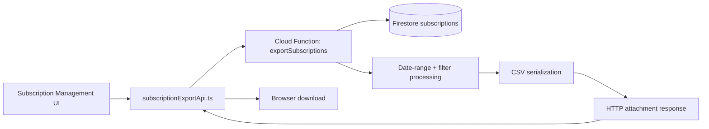
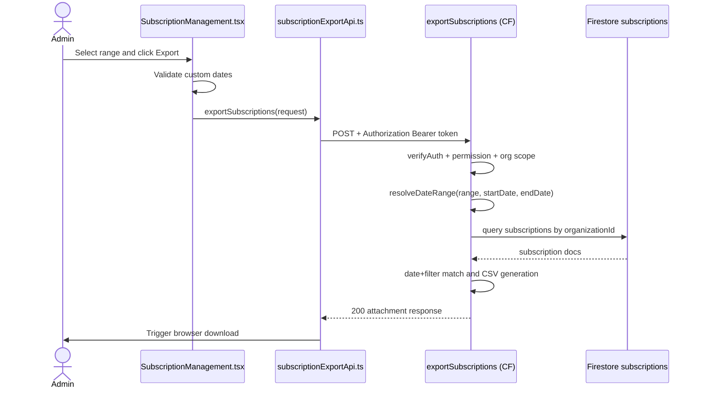

# Subscription Export Flow

## 1) Purpose

This document explains the subscription CSV export flow end-to-end:

- export trigger from Admin Subscription Management
- date-range and filter handling
- backend permission + organization checks
- CSV generation and download response

---

## 2) Scope

### In Scope

- Admin-triggered subscription export
- range handling (`current_month`, `past_month`, `custom`)
- search/status/interval filters
- backend CSV attachment response

### Out of Scope

- subscription lifecycle mutations (cancel/update payment method)
- donation and gift aid export internals
- recurring analytics dashboards

---

## 3) Files and Ownership

### Frontend

- `src/views/admin/SubscriptionManagement.tsx`
  - `handleExport` and range/date validation in UI

- `src/entities/subscription/api/subscriptionExportApi.ts`
  - authenticated function call and blob download handling

- `src/shared/config/functions.ts`
  - `FUNCTION_URLS.exportSubscriptions`

### Backend

- `backend/functions/handlers/subscriptionsExport.js`
  - date-range resolution
  - permission + org checks
  - filter application and CSV output

- `backend/functions/index.js`
  - function registration: `exports.exportSubscriptions`

---

## 4) High-Level Architecture

---

## 5) How / Why / Where

## A) UI Trigger and Validation

How:

1. Admin selects export range.
2. For `custom`, UI requires both `startDate` and `endDate`.
3. UI triggers export with organization, range, and filters.

Why:

- catches missing custom dates before network call.

Where:

- `src/views/admin/SubscriptionManagement.tsx`

## B) API Bridge

How:

1. Fetch current user ID token.
2. `POST` to `FUNCTION_URLS.exportSubscriptions`.
3. Parse file name from `content-disposition` and download CSV blob.

Why:

- keeps auth and download behavior consistent with other exports.

Where:

- `src/entities/subscription/api/subscriptionExportApi.ts`

## C) Backend Export Processing

How:

1. Verify auth and caller profile.
2. Enforce permission (`export_subscriptions` or `system_admin`).
3. Enforce org-scope for non-system-admin users.
4. Resolve UTC date window:
   - current month
   - past month
   - custom start/end
5. Query subscriptions by `organizationId`.
6. Keep rows with `createdAt` in range.
7. Apply filters (`searchTerm`, `status`, `interval`).
8. Build fixed CSV schema and return attachment.

Why:

- server-side date and filter logic ensures reliable, auditable exports.

Where:

- `backend/functions/handlers/subscriptionsExport.js`

---

## 6) Sequence

---

## 7) Request Contract

- `organizationId: string` (required)
- `range: "current_month" | "past_month" | "custom"` (required)
- `startDate?: "YYYY-MM-DD"` (required for `custom`)
- `endDate?: "YYYY-MM-DD"` (required for `custom`)
- `filters?:`
  - `searchTerm?: string`
  - `status?: string`
  - `interval?: string`

---

## 8) CSV Contract

Header order is fixed:

1. `donorName`
2. `donorEmail`
3. `stripeSubscriptionId`
4. `status`
5. `amountMinor`
6. `amountDisplay`
7. `interval`
8. `nextPayment`
9. `startedAt`
10. `createdAt`
11. `canceledAt`
12. `cancelReason`

Filename format:

- `subscriptions-{range}-{YYYYMMDD}-{YYYYMMDD}.csv`

---

## 9) Security and Validation

- `POST` only
- auth token required
- permission: `export_subscriptions` or `system_admin`
- cross-org export blocked for non-system-admin callers
- strict custom date parsing (`YYYY-MM-DD`)
- rejects end date before start date
- CSV formula sanitization is applied

---

## 10) Error Behavior

- `400`: invalid range/dates or missing required fields
- `403`: permission denied or cross-org attempt
- `405`: method not allowed
- `500`: unexpected backend failure

Frontend surfaces backend error messages in toast notifications.

---

## 11) Testing Checklist

1. Export succeeds for each supported range.
2. Custom range validation blocks missing/invalid dates.
3. Interval/status/search filters work as expected.
4. Non-system-admin cross-org export is rejected.
5. CSV headers and filename format are correct.
